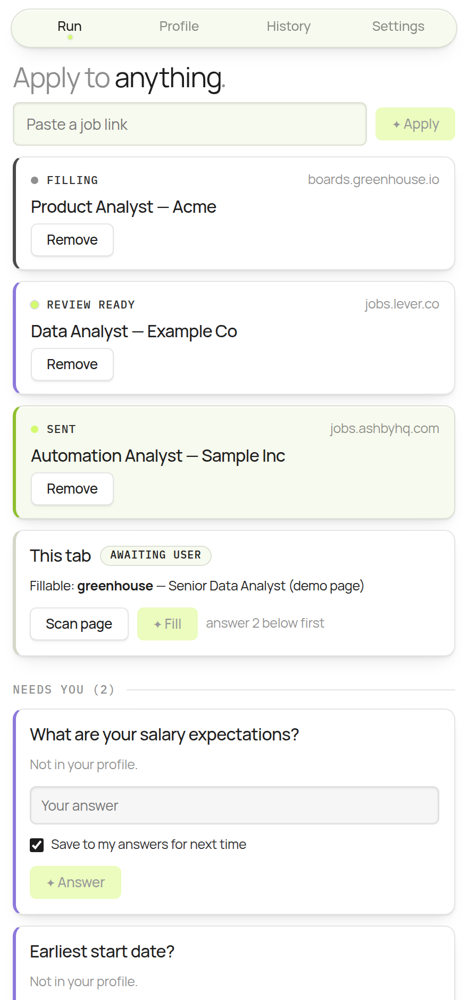

# LarpMaxer

**Your job applications, filled by an agent you own.**

[](https://github.com/RainMakerDanzee/larpmaxer/actions/workflows/ci.yml)
[](LICENSE)
[](CONTRIBUTING.md)

LarpMaxer comes in two forms that share one philosophy — truthful answers, your data on your
machine, nothing submitted until you say so:

- **[LarpMaxer Agent](plugin/README.md)** — the full agent, packaged as a Claude Code plugin.
  You drop in a resume and a job link; it researches the role, tailors materials it can prove
  are true, fills the application in a real browser, and stops before submit. This is the
  battle-tested path — the playbook it runs was distilled from real submissions across Ashby,
  SEEK, and LinkedIn. Needs a Claude subscription (Pro is enough); no API key.
- **The Chrome extension** (this repo's `packages/`) — a Manifest V3 extension around a tiny,
  zero-dependency TypeScript engine that autofills known ATS forms deterministically from your
  saved profile. No subscription needed; best on Greenhouse/Lever/Ashby forms it has adapters
  for. It types what you would type, pauses when it doesn't know something, and — unless you
  explicitly opt into auto mode — submits nothing until you have seen exactly what it filled.



## How it works

1. **Visit a posting.** Open a job ad on Greenhouse, Lever, or Ashby, then open the side
   panel — it scans the tab, the matching adapter detects the ATS, and the panel shows
   **Fillable: greenhouse**.
2. **Discover.** LarpMaxer walks the form and builds a typed model of every field — label, kind,
   options, required or not.
3. **Resolve.** Each field is answered from the nearest source, in order: direct profile fields,
   then your approved Q&A bank, then the LLM — constrained to facts in your profile. It never
   invents.
4. **Ask, once.** Anything it can't answer truthfully lands in the side panel's intake queue.
   You answer once; the answer is saved to your Q&A bank and never asked again.
5. **Fill and verify.** The content script types every value with React-proof input events,
   attaches your resume without an OS dialog, then reads every field back to prove it stuck.
6. **You approve.** The review card shows the complete filled form — every value, the resume
   filename. You click **Approve & Submit**; LarpMaxer clicks submit, verifies the success
   message, and records the application.

<!-- A fill-loop GIF belongs here, recorded against a real posting. It is
     deliberately not generated from the e2e fixture: that page is bare test
     markup, so a recording of it would look nothing like filling a real
     application. Record it live, review-gate on, and drop it in docs/img/. -->

## Quickstart

Requires Node 20+ and Chrome.

```bash
git clone https://github.com/RainMakerDanzee/larpmaxer
cd larpmaxer
npm install
npm run build
```

1. Open `chrome://extensions`, enable **Developer mode**, click **Load unpacked**, and select
   `packages/extension/dist`.
2. Click the LarpMaxer toolbar icon to open the side panel.
3. Fill in your profile — the fastest way is to upload your resume under **Resumes**:
   LarpMaxer reads it, shows you exactly what it found, and fills only the fields you have
   left empty. `.docx` and plain text are read directly; for a PDF, paste the text instead.
   The editor maps 1:1 to the `Profile` type, and
   [`examples/profile.example.json`](examples/profile.example.json) shows every field filled in.
4. Visit a Greenhouse, Lever, or Ashby posting and press **Fill**.

No API key is needed. Answering runs on Chrome's own built-in model by default, on your
machine, for free — open **Settings** once to download it if the panel says it needs to.
Machines that can't run it lose nothing: those questions come to you instead, and you can
add an Anthropic or OpenAI key there if you'd rather use one.

## The rules we won't break

These are product rules, not settings:

- **Truthful fill, from your profile only.** Every answer traces to your profile or to an answer
  you typed during intake. The LLM selects and formats; it never invents employers, dates,
  skills, or claims.
- **Unknown questions pause the run.** LarpMaxer asks you in the side panel, then remembers the
  answer in your Q&A bank so you are never asked twice.
- **You own logins and CAPTCHAs.** LarpMaxer never types passwords or one-time codes, never
  creates accounts, and never solves CAPTCHAs. It shows a "your turn" card and waits.
- **Review before submit.** By default nothing is submitted until you approve the full
  filled-form artifact. Auto mode is an explicit opt-in you flip in Settings, and either way
  every run is recorded in History with its per-field fill report.
- **100% local, zero telemetry.** Profile, Q&A bank, any key, and application history live in
  `chrome.storage.local`. On the default on-device model there are no LLM network calls at
  all; choose a cloud provider and the only calls are to that provider, with your own key.
  See [PRIVACY.md](PRIVACY.md).

## Supported ATS

| ATS | Adapter id | Status | Notes |
|---|---|---|---|
| Greenhouse | `greenhouse` | Supported | Hosted boards and embedded forms |
| Lever | `lever` | Supported | `jobs.lever.co` postings |
| Ashby | `ashby` | Supported | React form; trusted-keystroke quirk handled |
| Everything else | `generic` | Best effort | Label/ARIA-based discovery — review the artifact carefully |
| Anything the above can't read | `universal` | Model-read | The panel surveys the page and a model says which controls are the application. Works on sites nobody has written an adapter for; needs a model configured (the built-in one counts). Review the artifact carefully |

Yours missing? It should still fill: when no adapter can read a page, LarpMaxer describes the
page's controls to your model and asks which of them are the application — so a site nobody has
adapted works without anyone writing code for it. An adapter is still better where one exists,
because it knows the ATS's quirks, and it needs no model at all: a small pure function pair plus
a fixture-driven test, [about 30 minutes](docs/adapters.md).

## Architecture

```
┌─────────────────────────── Chrome ────────────────────────────┐
│  ┌───────────────┐   typed messages   ┌────────────────────┐  │
│  │  Side panel   │◄──────────────────►│ Background worker  │  │
│  │  (Preact UI)  │                    │  orchestrator      │  │
│  │ profile/intake│                    │  + LLM provider    │  │
│  │ review queue  │                    │  (BYO API key)     │  │
│  └───────────────┘                    └─────────┬──────────┘  │
│                                        inject / │ messages    │
│                                                 ▼             │
│                                       ┌────────────────────┐  │
│  ATS page (Greenhouse/Lever/Ashby/…)  │  Content script    │  │
│                                       │  @larpmaxer/core:   │  │
│                                       │  detect → discover │  │
│                                       │  → fill → verify   │  │
│                                       └────────────────────┘  │
└───────────────────────────────────────────────────────────────┘
```

Two packages. `packages/core` is the engine — pure TypeScript, zero runtime dependencies, runs
in Node for tests: detect → discover → resolve → fill → verify, plus the adapter registry and
the Anthropic/OpenAI providers. `packages/extension` is the MV3 product — background
orchestrator (state machine, LLM calls, storage), a thin content script that executes fill
plans, and the Preact side panel. Full details, module map, and data flow:
[ARCHITECTURE.md](ARCHITECTURE.md).

## Roadmap

- **Workday adapter** — the first user of `quirks.paginated`, which the executor now traverses; needs a captured fixture of the real form
- **SEEK** and other login-walled boards — human-assisted flow (you log in, LarpMaxer fills)
- **Batch mode** — queue several postings, answer intake once, review them all in one sitting
- **Desktop companion** — for the steps a browser extension can't reach
- **Firefox** port

## Contributing

Adapters are the best entry point — see [CONTRIBUTING.md](CONTRIBUTING.md) for the dev setup,
the test-first adapter workflow, and a list of good first adapters.

## License

MIT — see [LICENSE](LICENSE).
